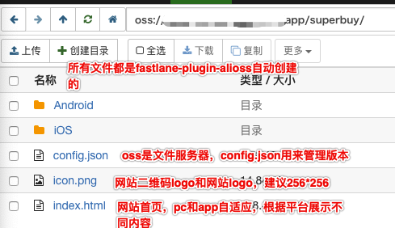
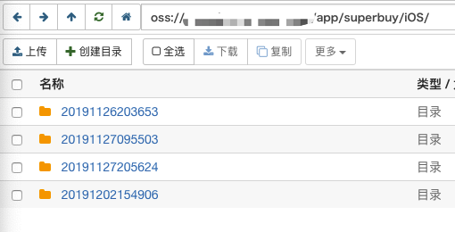
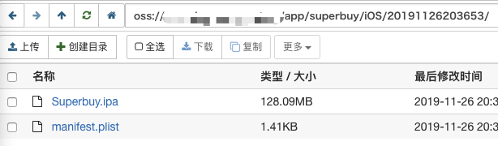

# alioss plugin

[](https://rubygems.org/gems/fastlane-plugin-alioss)

## Getting Started

This project is a [_fastlane_](https://github.com/fastlane/fastlane) plugin. To get started with `fastlane-plugin-alioss`, add it to your project by running:

```bash
fastlane add_plugin alioss
```

## About alioss

upload ipa/apk to aliyun oos server, and scan QRcode to install app on mobile phone.

**Note to author:** Add a more detailed description about this plugin here. If your plugin contains multiple actions, make sure to mention them here.


支持Mac和Windows <br>

---
MacOS平台：<br>
Make sure you have the latest version of the Xcode command line tools installed:

```
xcode-select --install
```

Install _fastlane_ using
```
[sudo] gem install fastlane -NV
```
or alternatively using `brew cask install fastlane`

Windows平台：<br>
1、Install ruby on your windows machine. ([不知道如何安装ruby？](https://www.runoob.com/ruby/ruby-installation-windows.html)) <br>
2、Go to your command line and type `gem install fastlane -NV`. <br>
3、You have fastlane on your windows machine ready. <br>
参考：https://stackoverflow.com/questions/43797206/fastlane-windows-cannot-installing <br>


MacOS & Windows环境配置好后，需要安装fastlane插件以支持iOS、Android个性化定制功能 <br>
* `gem 'fastlane-plugin-versioning'`
* `gem 'fastlane-plugin-appicon'`
* `gem 'fastlane-plugin-changelog'`
* `gem 'fastlane-plugin-pgyer'`
* `gem 'fastlane-plugin-alioss'`
* `gem 'fastlane-plugin-versioning_android'`  
<br>
不安装这些，首次使用命令时会自动安装 <br>

---

`Gemfile`文件需要添加阿里云ruby SDK `gem 'aliyun-sdk', '~> 0.3.0'` <br>

关于阿里云OSS文件服务器最终目录结构介绍：<br>
<br>
<br>
<br>
<br>
<br>

参考文档：[react-native fastlane自动化构建分发应用管理工具for iOS and Android（去掉RN即可移植到自己的项目）](https://www.cnblogs.com/wood-life/p/10649619.html) <br>

[完整的fastlane配置for iOS/Android](doc/fastlane配置.zip) <br>

如下是脚本片段，具体配置可以参考上面的链接。

```ruby
def upload_to_alioss(param)
  description = "正式环境"
  UI.message "====== upload_to_alioss ======\nparam入参：#{param}\n"
  if param[:mode] == "debug"
    description = "测试环境"
  end
  # 上传App到阿里云oss服务器
  alioss(
    endpoint: "oss-xxx.aliyuncs.com", # 您的站点 找运维要
    access_key_id: "xxxxxx",          # 您的id 找运维要
    access_key_secret: "xxxxxx",      # 您的秘钥 找运维要
    bucket_name: "app-test",          # 存放app文件的目录，自行创建
    app_name: "app/app1",             # 在bucket_name下面创建app目录，app下面可以分不同的app
    # 有了endpoint就有了下载链接 找运维要
    # 原始链接是这样：https://#{bucket_name}.#{endpoint} -> https://app-test.oss-xxx.aliyuncs.com/
    # 但是为了好记，请求运维给一个以你们公司名义命名的链接 -> https://dl.app.com/
    # 设置download_domain后，会生成：https://dl.app.com/app/app1/index.html
    # 最后包这个链接变成二维码，即可实现扫码下载
    download_domain: "https://dl.app.com/",
    update_description: "#{param[:desc]}\n#{description}",
    ipa: param[:ipa],
    apk: param[:apk]
  )
  store_shared_values
end


############################################### iOS #############################################
platform :ios do

  # 所有lane动作开始前都会执行这里的命令，例如指定打master上的包或执行project clean
  before_all do |options|
    ensure_git_status_clean
    git_pull
    sh("flutter pub get") 
    cocoapods(use_bundle_exec: false, podfile: "./ios/Podfile")
  end

  desc "构建一个测试环境版本上传至阿里云"
  lane :debug do|option|
    build_sign_app(mode: "debug")
    upload_to_alioss(desc: option[:desc], mode: "debug")
  end

  desc "构建一个正式环境版本上传至阿里云"
  lane :release do|option|
    build_sign_app(mode: "release")
    upload_to_alioss(desc: option[:desc])
  end

  desc "构建一个正式环境版本上传至AppStore"
  lane :appstore do|option|
    sign_appstore
    build_app(
      export_method: "app-store",
      workspace: "./ios/app.xcworkspace",
      scheme: "app",
      configuration: "Release",
      clean: true,
      output_directory: "./build/output/AppStore_#{Time.now.strftime('%Y%m%d%H%M%S')}",
      output_name: "app.ipa"
    )
    upload_to_app_store(app_identifier: "com.xxx.xxx")
    commit_version_bump(message: '[ci-skip] Bump build', xcodeproj: './ios/app.xcodeproj')
    push_to_git_remote
  end

end

```


## Example

Check out the [example `Fastfile`](fastlane/Fastfile) to see how to use this plugin. Try it by cloning the repo, running `fastlane install_plugins` and `bundle exec fastlane test`.

or <br>

Add <br>
`gem 'fastlane-plugin-alioss', git: 'https://github.com/woodtengfei/fastlane-plugin-alioss'`  or <br> 
`gem 'fastlane-plugin-alioss'`  <br>
to Gemfile. running `bundle install`.


Just specify the `endpoint` , `access_key_id` , `bucket_name` associated with your pgyer account.

```
lane :beta do
  gym
  alioss(endpoint: "oss-cn-shenzhen.aliyuncs.com", access_key_id: "xxx", access_key_secret: "xxx", bucket_name: "app-test")
end
```

Set a version update description for App:

```
lane :beta do
  gym
  alioss(endpoint: "oss-cn-shenzhen.aliyuncs.com", access_key_id: "xxx", access_key_secret: "xxx", bucket_name: "app-test", update_description: "update by fastlane")
end
```

**Note to author:** Please set up a sample project to make it easy for users to explore what your plugin does. Provide everything that is necessary to try out the plugin in this project (including a sample Xcode/Android project if necessary)

## Run tests for this plugin

To run both the tests, and code style validation, run

```
rake
```

To automatically fix many of the styling issues, use
```
rubocop -a
```

## Issues and Feedback

For any other issues and feedback about this plugin, please submit it to this repository.

## Troubleshooting

If you have trouble using plugins, check out the [Plugins Troubleshooting](https://docs.fastlane.tools/plugins/plugins-troubleshooting/) guide.

## Using _fastlane_ Plugins

For more information about how the `fastlane` plugin system works, check out the [Plugins documentation](https://docs.fastlane.tools/plugins/create-plugin/).

## About _fastlane_

_fastlane_ is the easiest way to automate beta deployments and releases for your iOS and Android apps. To learn more, check out [fastlane.tools](https://fastlane.tools).
